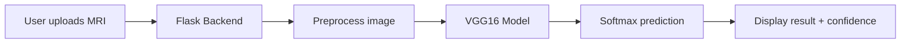

# MRI Brain Tumor Detection System

A deep learning project that classifies brain MRI scans into four categories — **Glioma**, **Meningioma**, **Pituitary**, and **No Tumor** — using transfer learning with VGG16, deployed as a Flask web application.

> **Disclaimer:** This project is for educational and research purposes only. It is not a substitute for professional medical diagnosis. Always consult a qualified healthcare provider for clinical decisions.

---

## Features

- **4-class MRI classification:** glioma, meningioma, pituitary tumor, no tumor
- **Transfer learning** with VGG16 (pre-trained on ImageNet)
- **Flask web UI** for uploading MRI images and viewing predictions
- **Confidence score** displayed with each prediction
- **Clinical information cards** for detected tumor types
- **Training notebook** with evaluation metrics (accuracy, confusion matrix, ROC-AUC)

---

## Tech Stack

| Layer | Technologies |
|-------|----------------|
| **Deep Learning** | TensorFlow 2.18, Keras 3.7, VGG16 |
| **Backend** | Python, Flask 3.1 |
| **Frontend** | HTML, CSS, Bootstrap 5, JavaScript |
| **Data / ML Utils** | NumPy, Pillow, scikit-learn, Matplotlib, Seaborn |
| **Training** | Google Colab, Jupyter Notebook |

---

## Project Structure

```
Braintumor/
├── main.py                                          # Flask web application
├── requirements.txt                                 # Python dependencies
├── models/
│   ├── brain_tumour_detection_using_deep_learning.ipynb   # Model training notebook
│   └── model.h5                                     # Saved trained model (required to run the app)
├── templates/
│   └── index.html                                   # Web UI
└── uploads/                                         # Uploaded images (created at runtime)
```

---

## Model Overview

| Parameter | Value |
|-----------|-------|
| Architecture | VGG16 (base) + Flatten + Dropout + Dense(128) + Dropout + Dense(4, softmax) |
| Input size | 128 × 128 × 3 (RGB) |
| Optimizer | Adam (learning rate: 0.0001) |
| Loss | Sparse categorical crossentropy |
| Batch size | 20 |
| Epochs | 5 |
| Test accuracy | ~95% |

### Training pipeline

1. Load MRI images from folder-based dataset (class = folder name)
2. Resize to 128×128 and normalize pixel values to [0, 1]
3. Apply augmentation (random brightness & contrast) during training
4. Fine-tune the last 3 layers of VGG16; freeze the rest
5. Evaluate with classification report, confusion matrix, and ROC curves
6. Save model as `models/model.h5`

---

## Dataset

The model is trained on a **Brain Tumor MRI** dataset with four classes:

| Class | Description |
|-------|-------------|
| **Glioma** | Tumor originating from glial cells |
| **Meningioma** | Tumor in the meninges (brain lining) |
| **Pituitary** | Tumor in the pituitary gland |
| **No Tumor** | Normal brain MRI |

- **Training images:** ~5,700  
- **Testing images:** 1,311  

> The dataset is not included in this repository due to size. You can use the [Brain Tumor MRI Dataset on Kaggle](https://www.kaggle.com/datasets/masoudnickparvar/brain-tumor-mri-dataset) or your own MRI images organized in the same folder structure.

---

## Installation

### Prerequisites

- Python 3.10+ recommended
- pip

### Steps

1. **Clone the repository**

   ```bash
   git clone https://github.com/YOUR_USERNAME/Braintumor.git
   cd Braintumor
   ```

2. **Create and activate a virtual environment**

   ```bash
   python -m venv venv

   # Windows
   venv\Scripts\activate

   # macOS / Linux
   source venv/bin/activate
   ```

3. **Install dependencies**

   ```bash
   pip install -r requirements.txt
   ```

4. **Place the trained model**

   Ensure `models/model.h5` exists. Train it using the Jupyter notebook in `models/`, or add your own exported model file.

---

## Usage

### Run the web application

```bash
python main.py
```

Open your browser and go to:

```
http://127.0.0.1:5000
```

1. Upload a brain MRI image (JPG/PNG)
2. Click **Analyze MRI Scan**
3. View the prediction, confidence score, and tumor information (if applicable)

### Train the model (optional)

Open and run `models/brain_tumour_detection_using_deep_learning.ipynb` in Google Colab or Jupyter. Update the dataset paths in the notebook, train the model, and save it as `models/model.h5`.

---

## Results

| Metric | Value |
|--------|-------|
| Training accuracy (epoch 5) | 96.63% |
| Test accuracy | 95% |
| Macro avg F1-score | 0.95 |

Per-class performance on the test set:

| Class | Precision | Recall | F1-Score |
|-------|-----------|--------|----------|
| Glioma | 0.95 | 0.88 | 0.91 |
| Meningioma | 0.99 | 0.98 | 0.99 |
| No Tumor | 0.99 | 0.96 | 0.98 |
| Pituitary | 0.87 | 0.97 | 0.92 |

---

## How It Works



1. User uploads an MRI image via the web form
2. Flask saves the file and preprocesses it (resize, normalize)
3. The trained VGG16 model predicts one of four classes
4. Results are rendered in the UI with confidence and clinical info

---

## Limitations

- Single 2D MRI slice only (not full 3D volume analysis)
- Not clinically validated for real-world medical use
- Performance depends on image quality and similarity to training data
- Requires the pre-trained `model.h5` file to run the web app

---

## Future Improvements

- [ ] Add Grad-CAM visualization for explainability
- [ ] Support DICOM medical image format
- [ ] Deploy to cloud (Render, AWS, etc.)
- [ ] Try other architectures (ResNet50, EfficientNet)
- [ ] Add validation split and hyperparameter tuning

---

## License

This project is open source. Add your preferred license here (e.g., MIT).

---

## Author

**Your Name**  
- GitHub: [@YOUR_USERNAME](https://github.com/YOUR_USERNAME)

---

## Acknowledgments

- [Brain Tumor MRI Dataset](https://www.kaggle.com/datasets/masoudnickparvar/brain-tumor-mri-dataset) (Kaggle)
- VGG16 pre-trained weights from ImageNet (TensorFlow/Keras)
