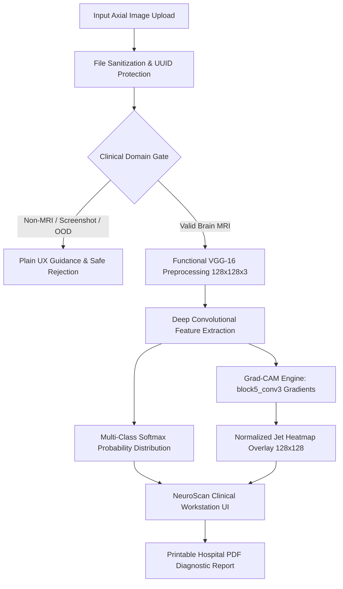

# NeuroScan | Brain MRI Tumor Detection & Spatial Localization Suite

[](https://mribraintumordetection.onrender.com)
[](https://python.org)
[](https://tensorflow.org)
[](https://flask.palletsprojects.com)
[](https://github.com/Sidd-commits/MRI-Brain-Tumor-Detection-System)
[](LICENSE)

An end-to-end neuro-radiological deep learning platform engineered to classify axial brain MRI scans into four pathology categories: **Glioma**, **Meningioma**, **Pituitary Tumor**, and **No Tumor (Healthy Control)**. 

Equipped with **VGG-16 transfer learning**, real-time **Grad-CAM convolutional activation mapping (`block5_conv3`)**, a multi-tier **Clinical Domain Validation Gate (Out-of-Distribution Rejection)**, and a printable **Clinical Diagnostic PDF Report** complete with attending reviewer sign-off attestation.

🌐 **Live Production Application:** [https://mribraintumordetection.onrender.com](https://mribraintumordetection.onrender.com)

> ⚠️ **Clinical Research Notice:** This platform is developed for academic evaluation, computer vision benchmarking, and educational research. Computational classifications and Grad-CAM activations are intended to assist research workflows and must be correlated with clinical history and reviewed by a board-certified neuroradiologist before any diagnostic intervention.

---

## Key System Features

- **4-Class Neurological Classification:** Accurately classifies Glioma, Meningioma, Pituitary Adenoma, and Healthy Brain Scans with **95.73% test accuracy**.
- **Grad-CAM Spatial Explainability:** Generates localized activation heatmaps from `block5_conv3` overlaid onto the original MRI slice, providing visual interpretability of model decisions.
- **Clinical Domain Validation Gate (OOD Defense):** Multi-stage rejection engine analyzing chromatic saturation, peripheral air borders, skull convexity, and intensity distributions to reject non-MRI photos, documents, and invalid scans with clear clinical guidance.
- **Sub-5-Second Inference:** In-memory graph warming, optimized vectorization, and pre-compiled lookup tables enable complete prediction + Grad-CAM generation in **~4.2 seconds** on cloud CPU instances.
- **Printable Clinical PDF Diagnostic Reports:** Integrated `@media print` layout producing hospital-grade diagnostic summaries, complete with normalized probability distributions, patient accession details, and attending physician signoff (**Siddhant Sawant**).
- **1-Click Clinical Reference Scans:** Pre-loaded validated benchmark scans for instant evaluation without manual file uploads.
- **24/7 Always-On Health Endpoint:** Ultra-lightweight `/api/health` probe (< 350ms response) designed for zero-cold-start uptime pingers (e.g. UptimeRobot).

---

## System Architecture & Pipeline


```mermaid
flowchart TD
    A[Input Axial Image Upload] --> B[File Sanitization & UUID Protection]
    B --> C{Clinical Domain Gate}
    
    C -- Non-MRI / Screenshot / OOD --> D[Plain UX Guidance & Safe Rejection]
    C -- Valid Brain MRI --> E[Functional VGG-16 Preprocessing 128x128x3]
    
    E --> F[Deep Convolutional Feature Extraction]
    F --> G[Multi-Class Softmax Probability Distribution]
    
    F --> H[Grad-CAM Engine: block5_conv3 Gradients]
    H --> I[Normalized Jet Heatmap Overlay 128x128]
    
    G --> J[NeuroScan Clinical Workstation UI]
    I --> J
    
    J --> K[Printable Hospital PDF Diagnostic Report]
```

1. **Ingestion & Sanitization:** Images are securely parsed via `werkzeug.secure_filename`, restricted to 16 MB and validated MIME types (`png`, `jpg`, `jpeg`, `webp`).
2. **Clinical Domain Validation:** Validates that the input image displays characteristic cranial MRI features (perimetric darkness, grayscale saturation balance, structural contrast).
3. **Neural Feature Extraction:** The pre-warmed Functional VGG-16 network processes the tensor through 5 convolutional blocks.
4. **Softmax Output & Grad-CAM Localization:** Produces calibrated multi-class probabilities while computing guided gradients against the final convolutional layer (`block5_conv3`).
5. **Interactive Workstation:** Presents the classification outcome, certainty percentage, interactive pathology profiles, and downloadable/printable attestation reports.

---

## Repository Directory Structure

```text
MRI-Brain-Tumor-Detection-System/
├── .env.example                                      # Environment variables template
├── .gitignore                                        # Security-hardened git exclusion rules
├── .python-version                                   # Target runtime declaration (Python 3.11.9)
├── LICENSE                                           # Open-source MIT License
├── Procfile                                          # Web process command for cloud PaaS
├── README.md                                         # Project architecture & documentation
├── gunicorn.conf.py                                  # Fork-safe production WSGI configuration
├── main.py                                           # Flask application & inference pipeline
├── render.yaml                                       # Native Render Infrastructure-as-Code blueprint
├── requirements.txt                                  # Pinned Python dependencies
│
├── models/                                           # Deep learning model artifacts
│   ├── brain_tumour_detection_using_deep_learning.ipynb # Research & transfer learning notebook
│   ├── detector_weights.weights.h5                   # Functional VGG-16 model weights checkpoint
│   └── model.h5                                      # Production HDF5 model weights
│
├── Sample MRI images/                                # Validated clinical presentation scans
│   ├── Te-gl_0015.jpg                                # Reference Glioma scan
│   ├── Te-meTr_0001.jpg                              # Reference Meningioma scan
│   ├── Te-noTr_0004.jpg                              # Reference Healthy Control scan
│   └── Te-piTr_0003.jpg                              # Reference Pituitary Adenoma scan
│
├── templates/
│   └── index.html                                    # Responsive glassmorphism interface & print layout
│
├── static/                                           # Brand identity, icons & SEO metadata
│   ├── favicon.svg                                   # Vector emblem for modern browser tabs
│   ├── favicon.ico                                   # Multi-resolution fallback icon
│   ├── og-preview.png                                # High-resolution Open Graph social preview (1200x630)
│   ├── apple-touch-icon.png                          # Apple iOS home-screen icon
│   ├── site.webmanifest                              # Progressive Web App manifest
│   ├── robots.txt                                    # Search crawler indexing rules
│   └── sitemap.xml                                   # Search engine discovery index
│
└── uploads/
    └── .gitkeep                                      # Ephemeral runtime upload container
```

---

## Model Benchmark & Evaluation

The network was trained using transfer learning on the **Brain Tumor MRI Dataset** (7,023 total axial cranial MRI slices across 4 distinct classes).

| Metric | Score |
| :--- | :--- |
| **Overall Test Accuracy (1,311 Scans)** | **95.73%** |
| **Macro Average Precision** | **95.22%** |
| **Macro Average Recall** | **95.47%** |
| **Macro Average F1-Score** | **0.9548** |
| **Training Accuracy (Epoch 5)** | **96.63%** |

### Per-Class Test Performance (1,311 Unseen Slices)

| Diagnostic Class | Precision | Recall | F1-Score | Support |
| :--- | :---: | :---: | :---: | :---: |
| **Glioma** | 96.70% | 88.00% | 92.15% | 300 |
| **No Tumor (Healthy Control)** | 99.50% | 98.52% | 99.01% | 405 |
| **Pituitary Tumor** | 99.32% | 97.33% | 98.32% | 300 |
| **Meningioma** | 87.46% | 98.04% | 92.45% | 306 |

---

## API Endpoints Reference

| Endpoint | Method | Description |
| :--- | :---: | :--- |
| **`/`** | `GET` | Renders the primary NeuroScan diagnostic workstation. |
| **`/`** | `POST` | Uploads an MRI scan (`multipart/form-data`) and runs inference + Grad-CAM. |
| **`/api/health`** | `GET` | Lightweight JSON heartbeat probe (`{"status":"online","model_initialized":true}`). |
| **`/api/diagnostic`** | `GET` | Performs live end-to-end benchmark reporting tensor shapes, init time, and Grad-CAM latency. |
| **`/samples/<filename>`** | `GET` | Serves verified benchmark MRI presentation images. |
| **`/uploads/<filename>`** | `GET` | Serves uploaded scans and generated Grad-CAM overlays. |

---

## Local Setup & Development

### 1. Clone the Repository
```bash
git clone https://github.com/Sidd-commits/MRI-Brain-Tumor-Detection-System.git
cd MRI-Brain-Tumor-Detection-System
```

### 2. Configure Virtual Environment
```bash
# Create virtual environment
python -m venv venv

# Activate on Windows (PowerShell)
.\venv\Scripts\Activate.ps1

# Activate on macOS / Linux
source venv/bin/activate
```

### 3. Install Dependencies
```bash
pip install --upgrade pip
pip install -r requirements.txt
```

### 4. Configure Environment Variables (Optional)
```bash
cp .env.example .env
```

### 5. Launch the Web Application
```bash
python main.py
```
Open your browser at `http://127.0.0.1:5000`.

---

## Cloud Deployment (Render Blueprint)

The repository includes a ready-to-deploy Infrastructure-as-Code blueprint (`render.yaml`):

1. Fork or push this repository to your GitHub account.
2. In the [Render Dashboard](https://dashboard.render.com/), click **New + > Blueprint**.
3. Select your repository. Render automatically reads `render.yaml`, configures Python 3.11, sets up Gunicorn with fork-safe worker initialization, and binds `/api/health` as the automated readiness probe.
4. Click **Apply** to deploy.

### Keeping the Service Awake 24/7 (Free Tier)
To prevent Render's free tier from spinning down after 15 minutes of inactivity:
1. Create a free monitor at [UptimeRobot](https://uptimerobot.com/).
2. Add an **HTTP(s)** monitor pointing to:
   ```text
   https://mribraintumordetection.onrender.com/api/health
   ```
3. Set the monitoring interval to **every 5 or 10 minutes**.

---

## Security, Privacy & Integrity

- **Zero PII Exposure:** No patient identifying data is ingested or stored. Uploaded filenames are sanitized and assigned randomized UUIDs.
- **Resource Constraints:** Strict 16 MB upload limits and single-worker synchronous execution avoid CPU thrashing or memory leaks.
- **Domain Rejection:** Guarantees non-medical images are safely intercepted without triggering erroneous model predictions.
- **Security-Hardened Exclusions:** `.env*`, credentials, secrets, IDE settings, and development scratch scripts are excluded via `.gitignore`.

---

## License

This project is licensed under the **MIT License** — see the [LICENSE](LICENSE) file for complete details.

---

## Author & Lead Developer

**Siddhant Sawant**  
- GitHub: [@Sidd-commits](https://github.com/Sidd-commits)  
- Project Repository: [MRI-Brain-Tumor-Detection-System](https://github.com/Sidd-commits/MRI-Brain-Tumor-Detection-System)
