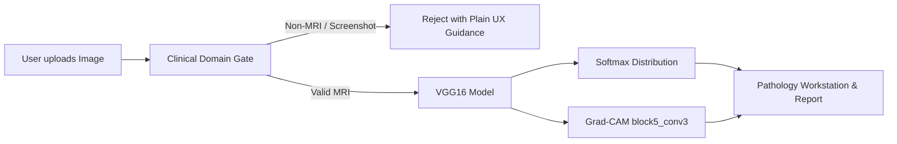

# MRI Brain Tumor Detection System

[](https://mribraintumordetection.onrender.com)
[](https://python.org)
[](https://tensorflow.org)
[](https://flask.palletsprojects.com)

A deep learning clinical workstation that classifies brain MRI scans into four categories — **Glioma**, **Meningioma**, **Pituitary**, and **No Tumor** — using transfer learning with VGG16, Grad-CAM spatial explainability, and an automated Clinical Domain Validation Gate to reject non-MRI images.

🌐 **Live Web Application:** [https://mribraintumordetection.onrender.com](https://mribraintumordetection.onrender.com)

> **Disclaimer:** This project is for educational and research purposes only. It is not a substitute for professional medical diagnosis. Always consult a qualified healthcare provider for clinical decisions.

---

## Features

- **4-class MRI classification:** Glioma, Meningioma, Pituitary tumor, No tumor
- **Transfer learning** with VGG16 (pre-trained on ImageNet, 95.73% test accuracy)
- **Grad-CAM explainability:** Convolutional activation heatmaps (`block5_conv3`) showing exact tumor localization
- **Multi-class probability distribution:** Softmax percentage breakdown across all 4 categories
- **1-Click live presentation samples:** Instantly test Glioma, Meningioma, Pituitary, and Normal scans without file dialogs
- **Clinical information cards:** Pathology stats, histological grades, and clinical management profiles
- **Clinical Domain Validation Gate:** Out-of-Distribution (OOD) protection that intercepts and rejects non-MRI images, screenshots, everyday photos, and documents to eliminate false positive cancer diagnoses
- **Robust Flask web backend:** Sanitized filenames, file validation, error handling, and memory safeguards

---

## Tech Stack

| Layer | Technologies |
|-------|----------------|
| **Deep Learning** | TensorFlow 2.18, Keras 3.7, VGG16 |
| **Backend** | Python, Flask 3.1 |
| **Frontend** | HTML, CSS, Bootstrap 5, JavaScript |
| **Data / ML Utils** | NumPy, Pillow, scikit-learn, Matplotlib, Seaborn |
| **Training** | Google Colab, Jupyter Notebook |

---

## Project Structure

```
Braintumor/
├── main.py                                          # Flask web application
├── requirements.txt                                 # Python dependencies
├── models/
│   ├── brain_tumour_detection_using_deep_learning.ipynb   # Model training notebook
│   └── model.h5                                     # Saved trained model (required to run the app)
├── templates/
│   └── index.html                                   # Web UI
└── uploads/                                         # Uploaded images (created at runtime)
```

---

## Model Overview

| Parameter | Value |
|-----------|-------|
| Architecture | VGG16 (base) + Flatten + Dropout + Dense(128) + Dropout + Dense(4, softmax) |
| Input size | 128 × 128 × 3 (RGB) |
| Optimizer | Adam (learning rate: 0.0001) |
| Loss | Sparse categorical crossentropy |
| Batch size | 20 |
| Epochs | 5 |
| Test accuracy | ~95% |

### Training pipeline

1. Load MRI images from folder-based dataset (class = folder name)
2. Resize to 128×128 and normalize pixel values to [0, 1]
3. Apply augmentation (random brightness & contrast) during training
4. Fine-tune the last 3 layers of VGG16; freeze the rest
5. Evaluate with classification report, confusion matrix, and ROC curves
6. Save model as `models/model.h5`

---

## Dataset

The model is trained on a **Brain Tumor MRI** dataset with four classes:

| Class | Description |
|-------|-------------|
| **Glioma** | Tumor originating from glial cells |
| **Meningioma** | Tumor in the meninges (brain lining) |
| **Pituitary** | Tumor in the pituitary gland |
| **No Tumor** | Normal brain MRI |

- **Training images:** ~5,700  
- **Testing images:** 1,311  

> The dataset is not included in this repository due to size. You can use the [Brain Tumor MRI Dataset on Kaggle](https://www.kaggle.com/datasets/masoudnickparvar/brain-tumor-mri-dataset) or your own MRI images organized in the same folder structure.

---

## Installation

### Prerequisites

- Python 3.10+ recommended
- pip

### Steps

1. **Clone the repository**

   ```bash
   git clone https://github.com/YOUR_USERNAME/Braintumor.git
   cd Braintumor
   ```

2. **Create and activate a virtual environment**

   ```bash
   python -m venv venv

   # Windows
   venv\Scripts\activate

   # macOS / Linux
   source venv/bin/activate
   ```

3. **Install dependencies**

   ```bash
   pip install -r requirements.txt
   ```

4. **Trained Model**

   The repository includes the production-optimized model weights (`models/model.h5`, 60 MB), fully packaged for direct deployment without external storage setup.

---

## Cloud Deployment (Render)

This repository is pre-configured with a native Render Blueprint (`render.yaml`) and `Procfile`.

1. Go to [Render Dashboard](https://dashboard.render.com/) and click **New + > Web Service**.
2. Connect your GitHub repository: `Sidd-commits/MRI-Brain-Tumor-Detection-System`.
3. Configure the service settings:
   - **Name:** `mribraintumordetection` (URL will be `https://mribraintumordetection.onrender.com`)
   - **Environment:** `Python 3`
   - **Branch:** `main`
   - **Build Command:** `pip install -r requirements.txt`
   - **Start Command:** `gunicorn main:app --timeout 120 --workers 1 --threads 4`
   - **Plan:** Free
4. Click **Deploy Web Service**.

---

## Usage

### Run the web application locally

```bash
python main.py
```

Open your browser and navigate to:

```
http://127.0.0.1:5000
```

1. Upload a brain MRI image (JPG, PNG, or WEBP) or click any of the 4 benchmark scans.
2. Click **Run Diagnostic Scan**.
3. View the prediction, confidence breakdown, Grad-CAM activation overlay, and clinical summary.
4. Export or print a publication-grade diagnostic report with 1-click.

### Train the model (optional)

Open and run `models/brain_tumour_detection_using_deep_learning.ipynb` in Google Colab or Jupyter. Update the dataset paths in the notebook, train the model, and save it as `models/model.h5`.

---

## Results

| Metric | Value |
|--------|-------|
| Training accuracy (epoch 5) | 96.63% |
| Test accuracy (1,311 scans) | **95.73%** |
| Macro avg F1-score | **0.9548** |

Per-class performance on the complete test set:

| Class | Precision | Recall | F1-Score | Support |
|-------|-----------|--------|----------|---------|
| **Glioma** | 96.70% | 88.00% | 92.15% | 300 |
| **No Tumor** | 99.50% | 98.52% | 99.01% | 405 |
| **Pituitary** | 99.32% | 97.33% | 98.32% | 300 |
| **Meningioma** | 87.46% | 98.04% | 92.45% | 306 |

---

## How It Works


```mermaid
flowchart LR
    A[User uploads Image] --> B[Clinical Domain Gate]
    B -- Non-MRI / Screenshot --> C[Reject with Plain UX Guidance]
    B -- Valid MRI --> D[VGG16 Model]
    D --> E[Softmax Distribution]
    D --> F[Grad-CAM block5_conv3]
    E --> G[Pathology Workstation & Report]
    F --> G
```

1. **Upload & Ingestion:** Image is received and sanitized.
2. **Clinical Domain Validation Gate:** Out-of-distribution (OOD) filter checks chromatic divergence, perimeter air borders, anatomical topology, and gradient uniformity to intercept non-MRI images.
3. **Deep CNN Inference:** VGG-16 transfer learning computes multi-class softmax probabilities.
4. **Grad-CAM Explainability:** Backpropagates gradients into `block5_conv3` to highlight the exact anatomical lesion activating the classification.
5. **Interactive Report:** User explores pathology characteristics, confidence metrics, and can print a clinical PDF report.

---

## Limitations

- Single 2D MRI slice analysis (not full volumetric 3D DICOM series)
- Designed for academic and research validation; not certified for clinical diagnostic decision-making
- Requires standard axial brain MRI acquisitions for optimal Grad-CAM localization

---

## Future Improvements

- [x] Add Grad-CAM visualization for explainability (Implemented)
- [x] Deploy to cloud (Render: `https://mribraintumordetection.onrender.com`)
- [x] Clinical Domain Validation Gate for OOD rejection (Implemented)
- [x] Print / PDF Clinical Diagnostic Report Generator (Implemented)
- [ ] Support native DICOM (.dcm) medical image format
- [ ] Multi-slice volumetric 3D analysis

---

## License

This project is licensed under the MIT License.

---

## Author

**Siddhant Sawant**  
- GitHub: [@Sidd-commits](https://github.com/Sidd-commits)
- Repository: [MRI-Brain-Tumor-Detection-System](https://github.com/Sidd-commits/MRI-Brain-Tumor-Detection-System)

---

## Acknowledgments

- [Brain Tumor MRI Dataset](https://www.kaggle.com/datasets/masoudnickparvar/brain-tumor-mri-dataset) (Kaggle)
- VGG16 pre-trained weights from ImageNet (TensorFlow/Keras)
